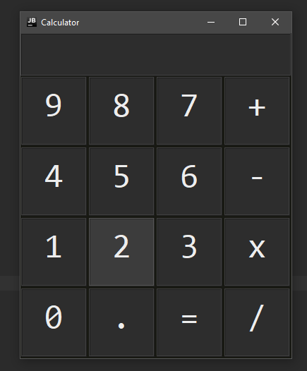

# Calculator GUI

    </img>

This is a calcualtor made with Java Swing. This is an older project, that I recently decided to update, fixing problems with decimal and negative numbers and also adding a keyboard support. It's still very basic and I've made a more advanced version in C# (https://github.com/Banogrono/AVCalculator).

---

